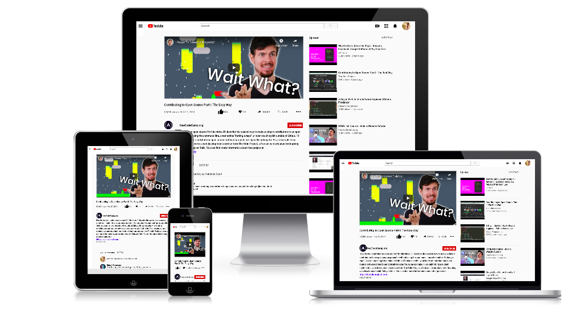

# Embedding videos and images: [Youtube](https://www.youtube.com) clone

This project is about cloning youtube player that demonstrates the knowledge of HTML, embedding images and videos using iframe, CSS flexbox properties was used for layout and also CSS media query for responsiveness.



## Built With

- HTML
  - Semantic HTML
  - HTML Forms
- CSS
  - CSS Flexbox for effective layout
  - CSS Media query for responsiveness
  - CSS Positioning
- [Prettier](https://prettier.io/) for code formatting
- [Stylelint](https://stylelint.io/) for CSS linting
- [HTML Validator](https://validator.w3.org/) and [Webhint](https://webhint.io/)
- [Github Actions for workflow](https://github.com/features/actions)
- [Netlify for deployment](https://app.netlify.com/)

## Live Demo

[Live Demo Link](https://bimbola-youtube-clone.netlify.app/)

### Development (Running locally)

- Clone the project

```bash
git clone https://github.com/bimbolabuari/odin-youtube-clone.git

```

- Install Dependencies

```bash
npm install
```

To run StyleLint by itself, you may run the lint task:

```bash
npm run lint:check
```

Or to automatically fix issues found (where possible):

```bash
npm run lint
```

You can also check against Prettier:

```bash
npm run format:check
```

and to have it actually fix (to the best of its ability) any format issues, run:

```bash
npm run format
```

You can also check against HTML Validator:

```bash
npm run html-validator
```

## Style Guides

- [CSS Style Guide](http://udacity.github.io/frontend-nanodegree-styleguide/css.html)
- [HTML Style Guide](http://udacity.github.io/frontend-nanodegree-styleguide/index.html)
- [JavaScript Style Guide](http://udacity.github.io/frontend-nanodegree-styleguide/javascript.html)
- [Git Style Guide](https://udacity.github.io/git-styleguide/)

## 👤 Abimbola Buari Aminat

- Github: [@bimbolabuari](https://github.com/bimbolabuari)
- Twitter: [@bimbolabuari](https://twitter.com/bimbolabuari)
- Linkedin: [@bimbolabuari](https://www.linkedin.com/in/bimbolabuari)

## 🤝 Contributing

Contributions, issues and feature requests are welcome!

Feel free to check the [issues page](../../issues).

## Show your support

Give a ⭐️ if you like this project!

## Acknowledgments

- [Youtube](https://www.youtube.com)
- [@bolah2009](https://github.com/bolah2009)

## 📝 License

[MIT licensed](./LICENSE).
