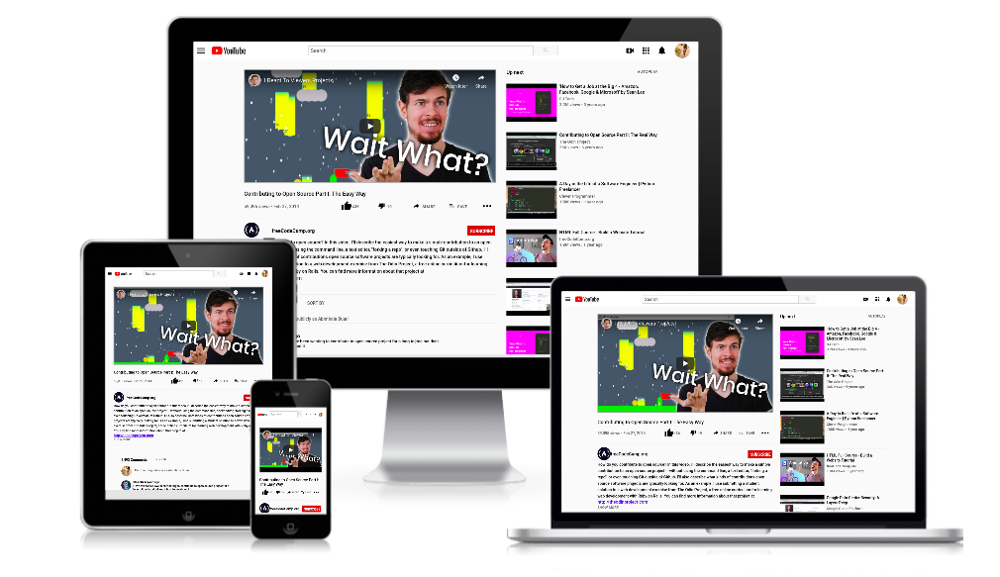

# Odin-youtube-clone

> This project is about embedding videos,images and using flexbox properties for positioning and also media query for responsiveness.




## Built With

- Hyper-text mark-up language
- Cascading styling sheet
- Mark-down language
- CSS Flexbox
- Media Query


## Live Demo

[Live Demo Link](https://deploy-preview-1--bimbola-youtube-clone.netlify.app/)

### Development (Running locally)

- Clone the project

```bash
git clone https://github.com/user/html-css-template.git

```

- Install Dependencies

```bash
npm install
```

To run StyleLint by itself, you may run the lint task:

```bash
npm run lint:check
```

Or to automatically fix issues found (where possible):
1

```bash
npm run lint
```

You can also check against Prettier:

```bash
npm run format:check
```

and to have it actually fix (to the best of its ability) any format issues, run:

```bash
npm run format
```

You can also check against HTML Validator:

```bash
npm run html-validator
```

## Style Guides

- [CSS Style Guide](http://udacity.github.io/frontend-nanodegree-styleguide/css.html)
- [HTML Style Guide](http://udacity.github.io/frontend-nanodegree-styleguide/index.html)
- [JavaScript Style Guide](http://udacity.github.io/frontend-nanodegree-styleguide/javascript.html)
- [Git Style Guide](https://udacity.github.io/git-styleguide/)

## 👤 Author

- Github: [@author](https://github.com/author)
- Twitter: [@author](https://twitter.com/author)
- Linkedin: [@author](https://www.linkedin.com/in/author/)

## 🤝 Contributing

Contributions, issues and feature requests are welcome!

Feel free to check the [issues page](../../issues).

## Show your support

Give a ⭐️ if you like this project!

## Acknowledgments

- Hat tip to anyone whose code was used
- Inspiration, resources/assets used
- etc

## 📝 License

[MIT licensed](./LICENSE).
